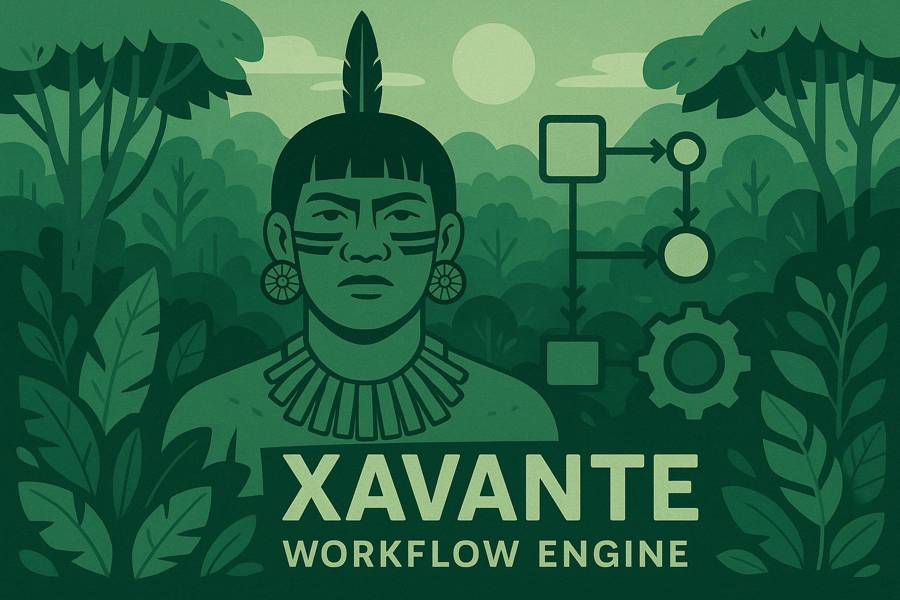

# 🚀 PHP Native Workflow Engine

A lightweight, open-source workflow engine to automate business processes using **native PHP**. Built on top of the **Slim Framework**, leveraging **MongoDB** for storage and **Redis** for queueing. Fully containerized with Docker for easy development and deployment.



## Why Xavante? 
This project is named Xavante (`"sha-VAHN-chee"`) as a tribute to the strength, structure, and resilience of the Xavante people of Brazil. Despite enduring persecution and displacement, they preserved their identity, traditions, and wisdom. Their dual clan system, sacred decision-making spaces, and powerful initiation rituals reflect a deep cultural logic—rooted in balance, endurance, and community.

By choosing this name, I hope to honor their memory and legacy, and acknowledge the strength of Indigenous knowledge systems that continue to inspire, even in the world of modern technology. This is a gesture of respect—for a people whose cultural richness deserves to be remembered and celebrated.


## ✨ Features

- 🛠 Native PHP 8.2 implementation
- 📦 RESTful API powered by [Slim Framework](https://www.slimframework.com/)
- 🗃 Workflow persistence using MongoDB
- ⚙ Job and task queuing via Redis
- 🐳 Dockerized environment
- 🔁 Supports asynchronous process execution


## 🧱 Tech Stack

| Component   | Tech                        |
|------------|-----------------------------|
| Language    | PHP 8.2                     |
| Framework   | Slim Framework              |
| Database    | MongoDB                     |
| Queue       | Redis                       |
| Containerization | Docker, Docker Compose |

## 🚀 Getting Started

### Prerequisites

- Docker & Docker Compose installed

### Clone and Run

```bash
git clone https://github.com/eduluz1976/xavante-server.git
cd xavante-server
cp .env.example .env
docker-compose up --build
```

### Create admin user

```bash
docker compose exec app php scripts/create-admin-user.php
```

If the user "_cacique_" does not exists, then this is the expected results:
```
Admin user created successfully:
{
    "id": "68d9d954392d4cb83f0d4051",
    "name": "_cacique_",
    "client_id": "019992f8-f3df-7036-8c46-ff2ef54be0e9",
    "secret": "Y2UwOGE1ZWM1ZDJkOTI2NmQxOGJmMWRhZWIzZjk3MmE5MGNkN2UwOGI1NDkyOGY4",
    "permissions": [
        {
            "role": "admin",
            "resource": "*"
        }
    ]
}
```

Otherwise,
```
Admin user already exists. No action taken.
```


### API Example

The API will be available at: [http://localhost:8080](http://localhost:8080)

```http
POST /api/v1/workflows/{workflow_id}/start 
```


## 🐳 Docker Overview

* **PHP App**: Runs the API using Slim
* **MongoDB**: Persists workflow definitions and execution states
* **Redis**: Handles async job queues
* **Queue Worker**: Background process consuming and executing queued steps

## ⚙ Environment Variables

All environment configuration is managed via `.env` file.

```env
APP_EXTERNAL_PORT=8080
MONGO_DATABASE=xavante
MONGO_HOST=db
MONGO_PORT=27017
MONGO_USERNAME=xavante_user
MONGO_PASSWORD=mySup3rS3cretPassword
MONGO_AUTH_SOURCE=admin
DB_UI_EXTERNAL_PORT=<port for my db client - dev env only>
REDIS_UI_EXTERNAL_PORT=<port for my redis client - dev env only>
```


## Tests

### Unit tests
```bash
docker compose exec app vendor/bin/phpunit tests/unit
```

### API tests
```bash
docker compose exec app vendor/bin/phpunit tests/api
```


## 📜 License

Apache 2.0 License. See `LICENSE` for details.

## 🤝 Contributing

1. Fork the repo
2. Create your feature branch: `git checkout -b feature/my-feature`
3. Commit your changes: `git commit -am 'Add new feature'`
4. Push to the branch: `git push origin feature/my-feature`
5. Open a pull request

## 📫 Contact

For bugs, suggestions, or feature requests, open an issue or contact [eduardo@eduardo-luz.com](mailto:eduardo@eduardo-luz.com).

---

Made with ❤️ using PHP.


